# Highly Opinionated Progression Guide

*Original guide written by **Drippy**. This file is a conversion of their work, not a rewrite.*

> Converted from the original PDF. The event-item sections in the
> source use a two-column layout that extraction scrambles; item/description pairs have been
> realigned. Wording is otherwise verbatim, including the author's own `(?)` uncertainty markers.

> **Art:** every image here comes out of the original PDF, so the screenshots and icons
> are the author's own.

## Table of Contents

- [New player/early game tactics](#new-playerearly-game-tactics)
  - [Early game gear](#early-game-gear) — Warrior, Mage, Priest, Ranger, Rogue, Paladin
  - [Early game useful event items & tips](#early-game-useful-event-items--tips) — Halloween, Xmas, Lunar New Year, Valentines, Easter
- [Mid game tactics](#mid-game-tactics)
  - [Mid game gear](#mid-game-gear) — Warrior, Mage, Priest, Ranger, Rogue, Paladin
  - [Mid game useful event items](#mid-game-useful-event-items) — Halloween, Xmas, Lunar New Year, Valentines, Easter
- [Late game tactics](#late-game-tactics)
  - [Late game gear](#late-game-gear) — Warrior, Mage, Priest, Ranger, Rogue, Paladin
  - [Late game useful event items](#late-game-useful-event-items) — Halloween, Xmas, Lunar New Year, Valentines, Easter
- [End game tactics](#end-game-tactics)
  - [End game gear](#end-game-gear) — Warrior, Mage, Priest, Ranger, Rogue, Paladin

---

## New player/early game tactics

+7/+8 vendor gear for whatever classes you choose. Never upgrade what you can't afford to lose. Keep your highest upgrade, then try to push higher on the next one. Weapons are your single highest damage boost when upgraded, focus these first. Try obtaining fire weapons for the classes that have them.

Start trying to acquire basic stat accessories, +3 at least. Orb of beginnings/cape from leather are the only real early game options for these slots if no events are active. Start fishing ASAP. You can acquire some end game items very early, and some items which are unobtainable through normal means like luck/gold scrolls. Join the goobrawl, snowman, and gigacrab events (if you see another player tanking it). These will award you fun tokens which can be traded in for useful items later on.

### Why vendor gear?

Adventureland uses a tiered equipment system with equipment being assigned a grade. Grade assignments are as follows: no grade, high, rare, legendary, and exalted. Once an item reaches exalted, it can not be further upgraded. The higher the grade, the more expensive an item is to upgrade. Higher grade items either take higher tier upgrade scrolls, have lower odds to succeed compared to lower grades, or the items are so rare that one will want to use primlings/primordials to increase the odds of success. The reason I suggest vendor gear is because it is the cheapest, and fastest way to increase in attack power. Gold income is quite low in the beginning, so the gold that you do get is best spent on readily available cheap to upgrade items.

### Why fire weapons?

Fire weapons are unique, in that they have a chance to proc a damage over time fire debuff. Once a character procs the debuff, it can be re-applied by any other character also using fire weapons, extending the duration by an additional 4 (? Double check) seconds. On top of this, if a player has higher attack power, they can apply higher intensity burns for more damage, so each sequential burn afterward will deal increased damage. If all three of your combat characters are using fire weapons early on, it can do extra damage equal to having a fourth combatant.

**Note:** fire weapons can be disassembled into fire essence, and then used to craft the weapon of your choosing.

### What makes fishing so special?

 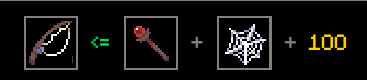

Fishing is crucial because it provides a small chance to obtain a lglitch. When one successfully fishes, they will be given an item from the drop table `G.drops.f1`. Most times you will get a piece of rugged gear, which can be sold to npcs for a small increase in gold income, or upgraded if you so choose. On rare occasions, one will get the lglitch (lesser glitch) drop. Only the merchant class can fish, and the player will need one spider silk, one staff, and 100 gold to craft a fishing rod.

### Glitch vs lglitch, what are they, why bother?

What makes these items so coveted is that they give the player a chance to obtain virtually any item in the game (some exceptions? Double check), even if they are not obtainable by conventional means. The glitch is a physical item that drops from green scorpions (xscorpion) and that can be exchanged at Xyn for a random item given from the drop table `G.drops.glitch`. When you get a lglitch however, a random roll happens and you are given an item from the drop table `G.drops.lglitch`. If one examines both of these drop tables, you will notice that glitches have better odds overall. So, why do I suggest fishing over farming if the odds for lglitch are worse? Because unless your merchant is dropping off potions to your fighters, or banking items, they are largely idle. You could dedicate your combat characters to farming xscorpions for a 1/500k drop, or you could make your lazy merchant get off their butt and be useful for once!

**If you think you got something good, check with the community discord. Don't get scammed, do not take the first immediate offer you get, even if it sounds like a good deal!**

### What do fun tokens do for me?

Fun tokens can be exchanged at Tricksy the clown for a handful of useful items. Mshield, rabbitsfoot, and exoarm are normally seasonal drops, so the ability to get these off season is very nice. The first two items are used to create a luck set for your tank. Xshield is a nice option for some additional XP on the classes that can wear it. Exoskeletal arm is a very good paladin offhand, given that paladins damage scales with both STR and INT.

### What is a "luck set"?

A luck set is a collection of items that give +luck to your tank. Improving luck improves your odds of obtaining items. **Luck does not improve upgrade odds.** Most luck items do not offer the normal combat focused stats, so it's important to have separate sets for luck and combat on your tank. Luck is applied to the chest a monster drops when the monster dies. The best way to utilize your luck set is to wait until a monster is low health, then equip all the luck items you have. Once it dies, swap back to your dps set and continue combat as normal. (Equip calls can be very costly, if done too often you will likely disconnect. If you can outheal the damage your tank takes, and you kill monsters too quickly to keep swapping back and forth, it might be better to just keep luck set equipped always.)

### Early game gear

#### Warrior

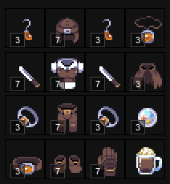

| Slot | Gear |
| --- | --- |
| **Weapons** | dual wield-ables, blade/fireblade. |
| **Headgear** | vendor helmet/wanderers cap. OX helmet. |
| **Chest** | vendor coat/wanderer attire, dragon armor. |
| **Gloves** | vendor glove/wanderers glove/mittens. |
| **Pants** | vendor pants/wanderer pants. |
| **Shoes** | vendor shoes/wanderer shoes/winged boots. |
| **Earrings** | basic STR earrings. |
| **Amulet** | basic STR amulet. |
| **Belt** | basic STR belt. |
| **Rings** | basic STR rings, suckerpunch if you are lucky. |
| **Cape** | basic cape. |
| **Orb** | orb of beginnings, low level STR orb if you find them on goblin/ponty. |
| **Elixir** | tank elixirluck, not tank pumpkinspice. |

#### Mage

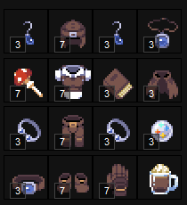

| Slot | Gear |
| --- | --- |
| **Weapon** | firestaff/mushroom staff, whichever you can get upgraded highest. |
| **Offhand** | wbook0. |
| **Headgear** | vendor helmet/wanderer cap, OX helmet. |
| **Chest** | vendor coat/wanderer attire, dragon armor. |
| **Gloves** | vendor glove/wanderers glove. |
| **Pants** | vendor pants/wanderer pants. |
| **Shoes** | vendor shoes/wanderer shoes/winged boots. |
| **Earrings** | basic INT earrings. |
| **Amulet** | basic INT amulet. |
| **Belt** | basic INT belt. |
| **Rings** | basic INT rings, suckerpunch if you are lucky. |
| **Cape** | basic cape. |
| **Orb** | orb of beginnings, low level INT orb if you find them on goblin/ponty, Jack o' lantern for additional rpierce. |
| **Elixir** | pumpkinspice. |

#### Priest

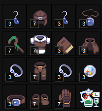

| Slot | Gear |
| --- | --- |
| **Weapon** | slimestaff/firestaff, whichever you can get upgraded highest. |
| **Offhand** | wbook0, spiked shield. |
| **Headgear** | vendor helmet/wanderer cap, OX helmet. |
| **Chest** | vendor coat/wanderer attire. |
| **Gloves** | vendor glove/wanderers glove. |
| **Pants** | vendor pants/wanderer pants. |
| **Shoes** | vendor shoes/wanderer shoes/winged boots. |
| **Earrings** | basic INT earrings. |
| **Amulet** | basic INT amulet. |
| **Belt** | basic INT belt. |
| **Rings** | basic INT rings, suckerpunch if you are lucky. |
| **Cape** | basic cape. |
| **Orb** | orb of beginnings, low level INT orb if you find them on goblin/ponty, Jack o' lantern for additional rpierce. |
| **Elixir** | elixirluck. |

#### Ranger

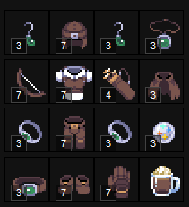

| Slot | Gear |
| --- | --- |
| **Weapon** | vendor bow/firebow. Firebow costs two essences instead of one and is higher grade than other fire weapons so it's a bit more expensive to get decently leveled. |
| **Offhand** | quiver. |
| **Headgear** | vendor helmet/wanderer cap, OX helmet. |
| **Chest** | vendor coat/wanderer attire, dragon armor. |
| **Gloves** | vendor glove/wanderers glove. |
| **Pants** | vendor pants/wanderer pants. |
| **Shoes** | vendor shoes/wanderer shoes/winged boots. |
| **Earrings** | basic DEX earrings. |
| **Amulet** | basic DEX amulet. |
| **Belt** | basic DEX belt. |
| **Rings** | basic DEX rings, suckerpunch if you are lucky. |
| **Cape** | basic cape. |
| **Orb** | orb of beginnings, low level DEX orb if you find them on goblin/ponty. |
| **Elixir** | pumpkinspice. |

#### Rogue

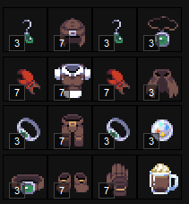

| Slot | Gear |
| --- | --- |
| **Weapons** | dual wield-ables claw, crab claw. |
| **Headgear** | vendor helmet/wanderer cap, OX helmet. |
| **Chest** | vendor coat/wanderer attire, dragon armor. |
| **Gloves** | vendor glove/wanderers glove. |
| **Pants** | vendor pants/wanderer pants. |
| **Shoes** | vendor shoes/wanderer shoes/winged boots. |
| **Earrings** | basic DEX earrings. |
| **Amulet** | basic DEX amulet. |
| **Belt** | basic DEX belt. |
| **Rings** | basic DEX rings, suckerpunch if you are lucky. |
| **Cape** | basic cape. |
| **Orb** | orb of beginnings, low level DEX orb if you find them on goblin/ponty. |
| **Elixir** | pumpkinspice. |

#### Paladin

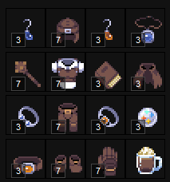

| Slot | Gear |
| --- | --- |
| **Weapon** | vendor mace/fireblade. Blades on paladin are -5% damage output but in general there aren't a lot of paladin options, so vendor is best early on. |
| **Offhand** | spiked shield, wbook0. |
| **Headgear** | vendor helmet/wanderer cap, OX helmet. |
| **Chest** | vendor coat/wanderer attire, dragon armor. |
| **Gloves** | vendor glove/wanderers glove. |
| **Pants** | vendor pants/wanderer pants. |
| **Shoes** | vendor shoes/wanderer shoes/winged boots. |
| **Earrings** | basic INT or STR earrings. |
| **Amulet** | basic INT or STR amulet. |
| **Belt** | basic INT or STR belt. |
| **Rings** | basic INT or STR rings, suckerpunch if you are lucky. |
| **Cape** | basic cape. |
| **Orb** | orb of beginnings, low level INT or STR orb if you find them on goblin/ponty. |
| **Elixir** | pumpkinspice. |

### Early game useful event items & tips

#### Halloween

| Item | Notes |
| --- | --- |
|  **Amulet of Spooks** | Non-upgradeable amulet that offers +xp/+gold/+luck. Easy item to acquire toward your eventual luck set. |
|  **Talking Skull** | +xp, helpful at all stages of the game if you value leveling. |
|  **Skull Amulet** | Potential cheap replacement amulet for Paladin because it offers both STR and INT, as well as a tiny bit of DEX. |
|  **Jack O' Lantern** | Useful orb for priest/mage. Useful on all classes as a means to disengage aggroed mobs (scare skill). |
| 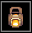 **Lantern** | Expensive to upgrade. Offers great resistance and evasion for offhand. |
|  **Hand of Midas** | Expensive to upgrade, offers 10% extra gold at +0, but slows your character move speed drastically. Best used swapping in after a mob is dead, looting, and swapping back to your offensive gloves. |
|  **Mystery Box** | Test your luck and win the Ultimate prize. Ultimate upgrade scroll lets you attempt an upgrade without a chance of breaking! Not to be used on trash tier items. Sell to end gamers for stupid amounts of gold, or save for your future. |
|  **Pumpkin Spice Latte** | Elixir item that offers free crit. Very handy at all stages of the game. |

**Tip:** killing jr/green jr gives halloween spirit buff. This offers 100% xp on characters below level (70?). Great for new players or people looking to level a new class/character.

#### Xmas

| Item | Notes |
| --- | --- |
|  **Mittens** | Offers apierce and rpierce for more damage. |
|  **Super Mittens** | Like mittens, offers apierce and rpierce, with the added bonus of attack speed. Unlikely that you'll get any if you are early game when xmas event is active, but if you do, don't risk over-upgrading. +4 is fine and still quite good. |
|  **Shield M** | Probably won't get many, but at +0 offers +8 luck. Another item for luck set. |
|  **Santa's Belt** | Readily available belt that offers DEX, plus a bit of bonus evasion. |
|  **Book of Cheer** | Unlikely to obtain many early on, but offers great resistance, extra vitality and DEX. Great priest item for tanking. |
|  **Xmas Sweater** | Doesn't need to be upgraded. Used by merchants to keep Grinch from robbing you. |
|  **Merry Mace** | Decent damage option for Paladin. Offers a small % chance to stun enemies on hit. |
| 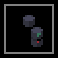 **Quantum Pieces** | Collect all nine different pieces to craft Xbox. Trade extras with other players to craft more, then sell the remainders for some decent early game gold. |

**Tip:** clicking the xmas tree in town gives you a holiday spirit buff and one fun token every 24 hours. This increases gold/xp/luck by 20%. Let the buff fall off before re-grabbing to maximize fun token gain. Do this on all characters, even inactive ones for a few extra tokens (and to save holiday buff for later if you decide to use the inactive character).

**Tip:** if the grinch attacks you for 40k damage, your cape will receive the Festive title. +1% luck. Every little bit helps.

#### Lunar New Year

| Item | Notes |
| --- | --- |
|  **OX Helmet** | Non-upgradeable helm that offers +10 of each basic stat, AND +1% damage output. Unlikely to acquire but older players probably have them stashed away. Ask around for cheap deals. |
| 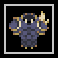 **Dragon Armor** | Non-upgradeable helm that offers +10 of each basic stat, AND +1% damage output. Unlikely to acquire but older players probably have them stashed away. Ask around for cheap deals. |
|  **Helmet of the Tiger** | Non-upgradeable helm that offers +10 of each basic stat, AND +1% damage output. Unlikely to acquire but older players probably have them stashed away. Ask around for cheap deals. |

**Tip:** probably don't bother with dragold if you are just starting out. His burn is very strong. You may get lucky and have other players help heal your fighters, but if their own fighters get low hp, they will prioritize themselves over you so don't expect to survive. The good news is that dying to the burn does not take xp like it does when dying to normal mobs. Feel free to death loop in an attempt to get those sweet sweet drops.

#### Valentines

| Item | Notes |
| --- | --- |
|  **Cupid's Bow** | Unique bow that heals targets instead of damaging. Can be useful for support heals as bows are usable by ranger, as well as rogue and warrior. |

**Note:** rogue and warrior have reduced hit chance while using bows.

#### Easter

| Item | Notes |
| --- | --- |
|  **Fluffy Blanket** | Slightly better than a basic cape. 2 piece set offers +5 luck, usually paired with Bunny Ears (eears). |
|  **Bunny Ears** | Offers a tiny bit of vitality. Gives +evasion per upgrade. Mostly used alongside fluffy blanket (ecape) to make the two piece bunny set (+5 luck). |
| 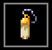 **Rabbit's Foot** | Unlikely you will get one if you are new when easter is active, but you never know. +luck item to add to your luck set. |
| 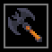 **Ghastly Battle Axe** | Decent chance to obtain during easter if you didn't bother farming bats yet. Needed for warrior cleave. Expensive to upgrade. |

**Tip:** killing the wabbit grants a 100% luck buff for 24 hours. Do this at least once a day to maximize your odds of getting egg drops. Gold eggs can be exchanged for gold, offering a great source of early game spending money.

---

## Mid game tactics

Start thinking about specialized items for each class outside of vendor gear. Also a good time to start looking at achievements. Depending on your coding ability, try your hand at monster hunts, there are a few worthwhile items from these, but not worth the effort to complete whole monster hunt sets currently.

Get tracktrix (4 monster hunt tokens) for each fighter. Good time to start gathering luck gear. More luck = more drops, and aside from mshield, most items don't need to be upgraded to increase their luck. If your income allows, think about buying a booster. Consider beginning to gather high armor/high resistance gear for your tank, in preparation of late game. Join the Franky fight to obtain bat keys. Dip your toes into the crypt. Join events whenever possible, particularly seasonal events. Maximize your chance at gear available once a year.

### Monster hunts?

Daisy in town will allow your fighters to undertake monster hunt quests. Each quest lasts 30 minutes. If you complete them you get one monster hunt token, if you fail to complete in the allotted time, you get nothing. You can take the quest on each fighter, and they will each get a different target. You can use this to your advantage, because the odds of getting a hunt you can actually complete increase three fold. Additionally, the quest does not need to be done solo. Once you have a quest you are confident in completing, send all three of your fighters to complete it quicker. If by chance you get quests on all characters that are too difficult, go back to normal farming, wait out the quest timer and try again.

**Tip:** Press C and click on the goo icon on the left of your screen to see what your target is, and how long you have left to complete your quest. (add screenshots?)

### Tracker and Achievements, what are those?

The tracktrix item can be obtained from Daisy in town for the cost of four monster hunt tokens. As the name suggests, the tracktrix keeps track of all monsters you've killed along your journey. When you reach certain kill thresholds for any given monster, you are awarded with extra bonus stats in the form of achievements. The game tracks all of your kills prior to obtaining a tracktrix, but only once you have one can you visually see how many you have killed, and most importantly **you need a tracktrix on each fighter to actually get the stat boosts**. The best thing about achievements is that they are account wide. If you ever find yourself lost on how to proceed, consider going for some of the more involved achievements. Notably rats. Not only do rats offer gold earrings that can be exchanged for tier two offhands, but at 10 million kills, you get a free 25 extra attack for all of your fighters (5 atk at 100k kills, 20 more at 10m). Other notable mobs include Poisio (1m kills +0.5 crit, 10m kills +1 attack speed), Spider (1m kills +0.25 crit, 10m kills +8 vit), and Scorpion (10m kills +15 atk).

### What is a booster?

A booster is a premium temporary item, buyable from Garwyn, that can increase your income in three different areas: gold, experience, and luck. Although the game offers three booster types to buy, no matter which one you choose, they can all be shifted between the three options. A +0 booster will last 28(?) days. Gold is applied on chest opening. When a mob dies, your luck is applied to the chest it drops, giving you better odds for an item drop. Similar to luck, XP is awarded on monster death. Because of this, you can optimally choose to shift between gold/xp, or gold/luck to fit your needs. Boosters can also be combined similar to accessories, to increase their level. Higher level boosters offer higher percentage boosts, and also increase duration by +2 days per level(?). Using a primordial essence while compounding boosters gives you a small chance to skip up a level. If you are extra lucky, you can skip multiple levels.

### What is Franky?

Franky is an event mob that spawns every few days. Once you attack him, he will continually spawn nerfed mummies on your location. Although they are low damage, you may quickly find yourself overwhelmed by mummies. Recommended strategy is to target the mummies first, then attack Franky in the time between mummy spawns. If you are too weak, wait for an established player to engage and then stick close to Franky. Chances are the established player will have some form of AOE damage. This means those pesky mummies will be wiped out without much effort on your part, allowing you to focus all your effort on Franky, increasing your contribution and chance for rewards.

### What is the crypt?

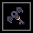

The crypt is an instanced dungeon that can be opened with the crypt keys that drop from Franky, or bats with a low chance. Although the crypt is an end game dungeon, the vbats inside offer great accessories with high drop chance. You may find it worthwhile to use keys just for these early on. If you decide to go after the vbats, be wary of Bill. He likes to hang around the bats and will randomly engage one of your characters.

### Mid game gear

#### Warrior

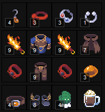

| Slot | Gear |
| --- | --- |
| **Weapons** | +9 fireblade x2. Orange/green lollipop from jr/green jr are introductory aoe weapons. Basher if you plan to stun, bat axe if you plan to cleave. Cleave is very mana intensive so not feasible until mid game. |
| **Headgear** | +9 vendor helmet/wanderers cap, OX helmet. Band of fury upgraded safely if you get one, to +3. Green pumpkin head for crit/lifesteal. |
| **Chest** | +9 vendor coat/wanderer attire. |
| **Gloves** | +9 vendor glove/wanderers glove. If around for xmas, mittens/supermittens. Gloves of the hunter warrior offer +1 crit. Fiery gloves are another option if you want attack speed. |
| **Pants** | +9 vendor pants/wanderer pants. |
| **Shoes** | +9 vendor shoes/wanderer shoes. +7/+8 winged boots. |
| **Earrings** | +3/+4 basic STR earrings, +3 crypt earrings. |
| **Amulet** | +4 basic STR amulet, +1 Stompy's nose ring. |
| **Belt** | +4 basic STR belt. |
| **Rings** | +4 basic STR rings, suckerpunch if you are lucky. |
| **Cape** | basic cape, ecape, well crafted cape, gcape, stealth cape. |
| **Orb** | +2/+3 STR orb. Jacko for scare skill to disengage if needed. |
| **Elixir** | pumpkin spice. |

#### Mage

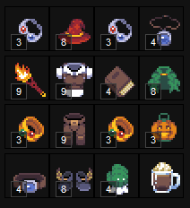

| Slot | Gear |
| --- | --- |
| **Weapon** | +9 firestaff, Harbinger, Oozing terror. |
| **Offhand** | +4 wbook0, +2 book of secrets. |
| **Headgear** | +9 vendor helmet/wanderer, OX helmet. Hat of the hunter mage offers additional pierce for small damage increase. Green pumpkin head for crit/lifesteal. |
| **Chest** | +9 vendor coat/wanderer attire. |
| **Gloves** | +9 vendor glove/wanderers glove. If around for xmas, mittens/supermittens. Fiery gloves are another option if you want attack speed. |
| **Pants** | +9 vendor pants/wanderer pants, low level starkillers. |
| **Shoes** | +9 vendor shoes/wanderer shoes. +7/+8 winged boots. |
| **Earrings** | +4 basic INT earrings, +3 crypt earrings. |
| **Amulet** | +4 basic INT amulet. |
| **Belt** | +4 basic INT belt. |
| **Rings** | +4 basic INT rings, +3 crypt rings, suckerpunch if you are lucky. |
| **Cape** | basic cape, ecape, well crafted cape, gcape, stealth cape. |
| **Orb** | INT orb, +3/+4 jacko for additional rpierce. |
| **Elixir** | pumpkin spice. |

#### Priest

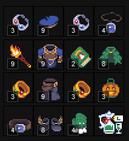

| Slot | Gear |
| --- | --- |
| **Weapon** | +9 firestaff, priest mace, ornament staff; whichever you can get upgraded highest. |
| **Offhand** | +4 wbook0, +2 book of secrets, +2 book of cheer. |
| **Headgear** | +9 vendor helmet/wanderer cap, OX helmet. |
| **Chest** | +9 vendor coat/wanderer attire. |
| **Gloves** | +9 vendor glove/wanderers glove. If around for xmas, mittens/supermittens. Fiery gloves are another option if you want attack speed. Gloves of the hunter priest offer 5% damage output which equates to larger heals.(?) |
| **Pants** | +9 vendor pants/wanderer pants. Low level starkillers. |
| **Shoes** | +9 vendor shoes/wanderer shoes. +7/+8 winged boots. |
| **Earrings** | +4 basic INT earrings, +3 crypt earrings. |
| **Amulet** | +4 basic INT amulet. |
| **Belt** | +4 basic INT belt. |
| **Rings** | +4 basic INT rings, +3 crypt rings. |
| **Cape** | basic cape, ecape, well crafted cape, gcape, stealth cape. |
| **Orb** | low level INT orb if you find them on goblin/ponty, +3/+4 Jack o' lantern for additional rpierce (improved healing). |
| **Elixir** | elixirluck. |

#### Ranger

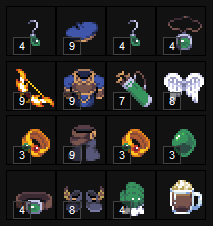

| Slot | Gear |
| --- | --- |
| **Weapon** | +9 vendor bow/firebow, bow of the dead, poucher. |
| **Offhand** | quiver, agile quiver. |
| **Headgear** | +9 vendor helmet/wanderer cap, OX helmet, Green pumpkin head for crit/lifesteal. |
| **Chest** | +9 vendor coat/wanderer attire. |
| **Gloves** | +9 vendor glove/wanderers glove. If around for xmas, mittens/supermittens. Fiery gloves are another option if you want attack speed. |
| **Pants** | +9 vendor pants/wanderer pants. |
| **Shoes** | +9 vendor shoes/wanderer shoes, +7/+8 winged boots. |
| **Earrings** | +4 basic DEX earrings. |
| **Amulet** | +4 basic DEX amulet. |
| **Belt** | +4 basic DEX belt. |
| **Rings** | +4 basic DEX rings, suckerpunch if you are lucky, +3 crypt rings. |
| **Cape** | basic cape, ecape, well crafted cape, gcape, angel wings. |
| **Orb** | +2/+3 DEX orb, jacko for disengage. |
| **Elixir** | pumpkin spice. |

#### Rogue

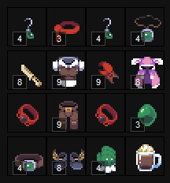

| Slot | Gear |
| --- | --- |
| **Weapons** | +9 crab claw, dagger of the dead. |
| **Headgear** | +9 vendor helmet/wanderer cap, OX helmet. Helmet of the Tiger, Green pumpkin head, Band of fury. |
| **Chest** | +9 vendor coat/wanderer attire, dragon armor (if you need INT for mental burst). |
| **Gloves** | +9 vendor glove/wanderers glove. If around for xmas, mittens/supermittens. Fiery gloves are another option if you want attack speed. |
| **Pants** | +9 vendor pants/wanderer pants. |
| **Shoes** | +9 vendor shoes/wanderer shoes, +7/+8 winged boots. |
| **Earrings** | +4 basic DEX earrings. |
| **Amulet** | +4 basic DEX amulet. |
| **Belt** | +4 basic DEX belt. |
| **Rings** | +4 basic DEX rings, suckerpunch if you are lucky, +3 crypt rings. |
| **Cape** | basic cape, ecape, well crafted cape, gcape, stealth cape. |
| **Orb** | +2/+3 DEX orb, jacko for disengage. |
| **Elixir** | pumpkin spice. |

#### Paladin

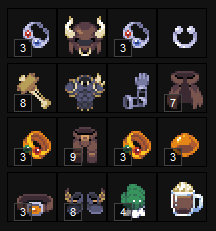

| Slot | Gear |
| --- | --- |
| **Weapon** | +9 vendor mace, Merry Mace, Hammer, mace of the dead. Most of these are event weapons so the highest upgrade you can manage. |
| **Offhand** | +8/+9 spiked shield, +4 wbook0, +2 book of secrets, +0 exo arm. |
| **Headgear** | +9 vendor helmet/wanderer cap, OX helmet. |
| **Chest** | +9 vendor coat/wanderer attire, dragon armor (still useful for paladin since it benefits from both STR and INT). |
| **Pants** | +9 vendor pants/wanderer pants. |
| **Shoes** | +9 vendor shoes/wanderer shoes, +7/+8 winged boots. |
| **Earrings** | +4 basic INT or STR earrings, +3 crypt earrings are particularly nice for paladin since damage scales off both STR and INT. |
| **Amulet** | +4 basic INT or STR amulet, Stompy's nose ring. |
| **Belt** | +4 basic INT or STR belt. |
| **Rings** | +4 basic INT or STR rings, suckerpunch if you are lucky, +3 crypt rings. |
| **Cape** | basic cape, ecape, well crafted cape, gcape, stealth cape. |
| **Orb** | +2/+3 STR orb, INT orb if you can kill pppompom, jacko for disengage. |
| **Elixir** | pumpkin spice. |

### Mid game useful event items

#### Halloween

| Item | Notes |
| --- | --- |
|  **Band of Fury** | Best in slot headgear for warrior/rogue. Probably won't get more than a few, upgrade to safe levels and keep them. After you have your characters outfitted, upgrade extras if you dare. |
|  **Starkiller's Pants** | Best in slot pants for priest/mage. Offers high rpierce and some crit (not useful for priest). Upgrade safely then blow up extras. |
| 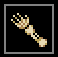 **Dead Weapons** | Able to be dismantled and re-forged for the class weapon you desire. Particularly good options for rogue and ranger. Also good for paladin since there are not many options weapon-wise. |
|  **Throwing Stars** | If you have bank space and play rogue, save as many as you can. Used to craft fiery throwing stars for rogue offhand fire procs or used to craft snowflakes for freeze proc (greatly reduces enemy move speed). |
|  **Lollipop Mace (orange)** | Warrior aoe items, chance to proc sugar rush (increased attack speed). Orange is +STR variant. |
|  **Lollipop Mace (green)** | Warrior aoe items, chance to proc sugar rush (increased attack speed). Green is +DEX variant. |
|  **Jack O' Lantern** | Keep combining these, try to get +4's for your priest/mage. |
|  **Lantern** | If you can afford to, try getting +3's for your fighters if you plan to take on Dragold later in the year. |
|  **Hand of Midas** | Now that you have a bit more gold coming in, try to upgrade these further to improve all future income. |
|  **Mystery Box** | Treat yo self. Exchanging these gives you a chance at scroll3 and cscroll3, both of which are quite costly and will be needed in the later/end game. Also hope to hit the jackpot and get an Ultimate Upgrade Scroll. |
| 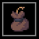 **Pouch of Poof** | Used to craft aoe ranger weapon. Only stacks to 100, takes up a lot of bank space. Expensive to craft. Save them if you can afford the bank space and play ranger. |

#### Xmas

| Item | Notes |
| --- | --- |
|  **Mittens** | Offers apierce and rpierce for more damage. |
|  **Super Mittens** | Like mittens, offers apierce and rpierce, with the added bonus of attack speed. Upgrade to +4s, attempt higher with any extras. |
|  **Shield M** | Should get more this time around, attempt upgrades to increase your luck. |
|  **Book of Cheer** | Bully the grinch, try to increase the level of your book of cheer(s). |
|  **Ring of Holidays** | Low chance to drop from grinch, great luck item if you do manage to get one though. Pray to rngesus. |
|  **Super Sweater** | Decent chest option for merchant, offers high vit. Expensive to upgrade so only bother if you have excess gold. |
|  **Quantum Pieces** | Used to craft Xbox. Craft what you can, trade extras to craft more. Hope to get Band of Fury, Starkillers, Exo Arm, or the North Star. |

**Tip:** grinch can be lured to kane for increased luck %. Don't be greedy! Instead of following the grinch trying to maximize your contribution, seek out Kane once he is low health and wait. The more people near kane, the greater the chances the grinch will choose someone nearby to jump on. You and everyone else will be rewarded more.

#### Lunar New Year

| Item | Notes |
| --- | --- |
|  **Tiger Shield** | If the tiger happens to be active, this shield offers the highest resist/armor. |
|  **Tiger Cape** | If the tiger is active, this is a (slightly) better well crafted cape. |
| 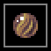 **Tiger Stone** | If the tiger is active, sellable to npcs for a nice little gold boost. Offers speed and vit. |
|  **Helm of the Tiger** | Mostly useless at this stage, sellable to npc for a gold boost. |
| 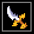 **Dragon Dagger** | Stupid low odds. Can be used to pull Cunn npc to any map to help you fight. More of a novelty than anything. |
|  **Lunar Mace** | Useful luck set item for priest. Expensive to upgrade, but not necessary if you plan to swap between luck/fighting sets. |
|  **Golden Eggs** | If you can survive the Dragolds onslaught, golden eggs are a good source of extra spending money. Also at this stage may want to consider hanging on to some for future projects (shiny items, golden gun, ancient computer). |

**Tip:** the tiger prefers to be pet, instead of killed ;).

#### Valentines

| Item | Notes |
| --- | --- |
|  **Cupid's Bow** | Unique bow that heals targets instead of damaging. Can be useful for support heals as bows are usable by ranger, as well as rogue and warrior. |

#### Easter

| Item | Notes |
| --- | --- |
|  **Fluffy Blanket** | If you don't have a better cape yet, try to improve the upgrade level. |
|  **Bunny Ears** | Offers a tiny bit of vitality. Gives +evasion per upgrade. Mostly used alongside fluffy blanket (ecape) to make the two piece bunny set (+5 luck). |
|  **Rabbit's Foot** | Hope to get a few, combine to better your luck set, or spread them between your fighters to improve cooperative mob drop chances. |
|  **Ghastly Battle Axe** | Decent chance to obtain during easter if you didn't bother farming bats yet. Needed for warrior cleave, push for +7/+8. |
| 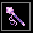 **Pink Wand** | Lower damage but higher attack speed option for priest/mage. Great for attacking enemies that only take 1 damage per hit (cute bee, snowman, etc). |
|  **Golden Eggs** | If you can survive the Dragolds onslaught, golden eggs are a good source of extra spending money. Also at this stage may want to consider hanging on to some for future projects (shiny items, golden gun, ancient computer). |

---

## Late game tactics

Attempt to push your gear further beyond. Slots like pants and helmet can be upgraded to +X for more base stat, if you are still using vendor items. If you haven't already, get those winged boots to +9 for extra attack speed. Start trying to secure yourself some manasteal, it will be crucial later on. Look to start killing mobs like Ents and Fire roamers for decent gold/xp. Start upgrading boosters for even better income. If you've managed to get any darkforge along your journey, time to start upgrading that to beef up your priest's resistances/armor. Head into the crypt and start showing those vampires who is boss. Vhammer is a great AOE tool for warriors, especially when combined with a lollipop mace offhand. Vdagger will take your rogue to the next level. Cybernetic implants are a good headgear option for classes that can't use Band of Fury. Lots of good things to obtain in the crypt. Struggle, adapt, and overcome. Dominate seasonal events for more loot with your enhanced luck. Hoard until you have the gold to process.

### Why is manasteal important?

Because the highest available mana potion only regenerates 500mp, one thing you will begin to notice late game is that your mana consumption far outweighs your ability to regenerate mana. Manasteal steals some mana from the monster you attack, and regenerates it to your fighter. This gives you more available mana to use on skills. More skills, more damage, more kills.

### Late game gear

#### Warrior

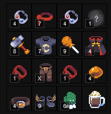

| Slot | Gear |
| --- | --- |
| **Weapons** | +7/+8 vhammer, +9 orange/green lollipop, +9 bat axe. |
| **Headgear** | band of fury, highest upgrade you can manage. |
| **Chest** | manasteal tshirt (best used with aoe), +X vendor coat/wanderer attire. +7 vattire and above. |
| **Gloves** | +9 mittens, supermittens as high as you can manage. |
| **Pants** | +X vendor pants/wanderer pants. |
| **Shoes** | +9 winged boots. |
| **Earrings** | +4/+V basic STR earrings, +4 crypt earrings, +3 mole teeth. |
| **Amulet** | Stompy's nose ring. If you have managed to amass a fair amount of crit, look into getting bfang amulet. It offers extra crit damage, apierce AND lifesteal. If you are a masochist, mystery amulets are also a decent option. |
| **Belt** | +4 basic STR belt. |
| **Rings** | suckerpunch. |
| **Cape** | well crafted cape, gcape, tiger cape, vcape. |
| **Orb** | +4 STR orb. Jacko for scare skill to disengage if needed. |
| **Elixir** | pumpkin spice. |

**Tip:** if you want to push your warrior to the next level, look into getting firehazard title on your weapons. +4% extra crit damage per weapon. Extra powerful when combined with bfang amulet.

#### Mage

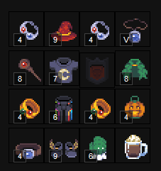

| Slot | Gear |
| --- | --- |
| **Weapon** | +9 firestaff, +7 blaster and above. |
| **Offhand** | +4/+V wbook0, +3 book of secrets. If using a blaster, no offhand can be equipped as it's a two handed weapon. |
| **Headgear** | +9 Hat of the hunter mage, cybernetic implant. |
| **Chest** | +X vendor coat/wanderer attire, manasteal, +7 vattire. |
| **Gloves** | +9 mittens, supermittens as high as you can manage. |
| **Pants** | +X vendor pants/wanderer pants, mid level starkillers. |
| **Shoes** | +9 winged boots. |
| **Earrings** | +4/+V basic INT earrings, +4 crypt earrings. |
| **Amulet** | +4/+V basic INT amulet. |
| **Belt** | +4/+V basic INT belt. |
| **Rings** | +4/+V basic INT rings, suckerpunch if you are lucky, +4 crypt rings. |
| **Cape** | well crafted cape, gcape, vcape. |
| **Orb** | INT orb, +4 jacko for additional rpierce. |
| **Elixir** | pumpkin spice. |

#### Priest

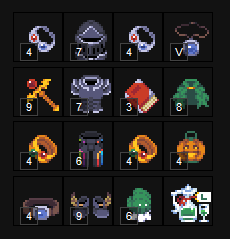

| Slot | Gear |
| --- | --- |
| **Weapon** | +9 firestaff, +9 lunar staff. |
| **Offhand** | +4/+V wbook0, +3 book of secrets, +3/+4 book of cheer. |
| **Headgear** | cybernetic implant, +7/+8 darkforge. |
| **Chest** | +7/+8 darkforge. |
| **Gloves** | +9 mittens, mid level supermittens, +7/+8 dark forge gloves. |
| **Pants** | mid level starkillers. |
| **Shoes** | +9 winged boots. |
| **Earrings** | +4 crypt earrings. |
| **Amulet** | +4/+V basic INT amulet, tier 2 STR amulet (offers resistance). |
| **Belt** | +4/+V basic INT belt, well crafted belt. |
| **Rings** | +3/+4 crypt rings. |
| **Cape** | ecape, gcape, stealth cape. |
| **Orb** | INT orb, +4/+V jacko for additional rpierce (improved healing). |
| **Elixir** | elixirluck. |

#### Ranger

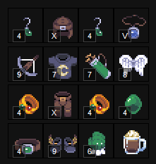

| Slot | Gear |
| --- | --- |
| **Weapon** | +9 firebow, bow of the dead, Crossbow (slower aspeed, higher damage), +X poucher. |
| **Offhand** | agile quiver. |
| **Headgear** | +X vendor helmet/wanderer cap, cybernetic implant. |
| **Chest** | +X vendor coat/wanderer attire, manasteal tshirt. |
| **Gloves** | +9 mittens, mid level supermittens. |
| **Pants** | +X vendor pants/wanderer pants. |
| **Shoes** | +9 winged boots. |
| **Earrings** | +4/+V basic DEX earrings, +3 mole teeth. |
| **Amulet** | +4/+V basic DEX amulet. |
| **Belt** | +4/+V basic DEX belt. |
| **Rings** | suckerpunch, +4 crypt rings. |
| **Cape** | well crafted cape, gcape, vcape, angel wings. |
| **Orb** | +4/+V DEX orb, jacko for disengage, vtooth to help prevent fear from 5shot. |
| **Elixir** | pumpkin spice. |

#### Rogue

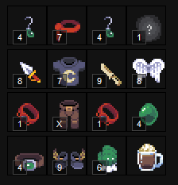

| Slot | Gear |
| --- | --- |
| **Weapons** | +9 dagger of the dead, +8 vdagger, +8/+9 firestars. |
| **Headgear** | Band of fury, as high as you can. |
| **Chest** | +X vendor coat/wanderer attire, +7 vattire. |
| **Gloves** | +9 mittens, mid level supermittens. |
| **Pants** | +X vendor pants/wanderer pants. |
| **Shoes** | +9 winged boots. |
| **Earrings** | +4/+V basic DEX earrings, +3 mole teeth. |
| **Amulet** | +4/+V basic DEX amulet, mystery amulet, bfang amulet. |
| **Belt** | +4/+V basic DEX belt. |
| **Rings** | suckerpunch, +4 crypt rings. |
| **Cape** | well crafted cape, gcape, vcape. |
| **Orb** | +4/+V DEX orb, jacko for disengage. |
| **Elixir** | pumpkin spice. |

**Tip:** if you want to push your rogue to the next level, look into getting firehazard title on your weapons. +4% extra crit damage per weapon. Extra powerful when combined with bfang amulet.

#### Paladin

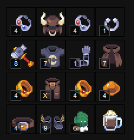

| Slot | Gear |
| --- | --- |
| **Weapon** | +7/+8 vhammer. |
| **Offhand** | exo arm, +9 spiked shield, +4/+5 wbook0, +3 book of secrets. |
| **Headgear** | OX helmet, Cybernetic Implant. |
| **Chest** | +X vendor coat/wanderer attire, manasteal tshirt. |
| **Pants** | +X vendor pants/wanderer pants. |
| **Shoes** | +9 winged boots. |
| **Earrings** | +4/+V crypt earrings. |
| **Amulet** | +4/+V basic INT or STR amulet, mystery amulet, stompy's nose ring. |
| **Belt** | +4/+V basic INT or STR belt. |
| **Rings** | suckerpunch, +4 crypt rings. |
| **Cape** | well crafted cape, gcape, vcape. |
| **Orb** | +4 STR orb, INT orb if you can kill pppompom, jacko for disengage. |
| **Elixir** | pumpkin spice. |

### Late game useful event items

#### Halloween

| Item | Notes |
| --- | --- |
|  **Band of Fury** | Best in slot headgear for warrior/rogue. Push your upgrades higher. |
|  **Starkiller's Pants** | Best in slot pants for priest/mage. Push your upgrades higher. |
|  **Dead Weapons** | Able to be dismantled and re-forged for the class weapon you desire. Particularly good options for rogue and ranger. Also good for paladin since there are not many options weapon-wise. |
|  **Throwing Stars** | If you have bank space and play rogue, save as many as you can. Used to craft fiery throwing stars for rogue offhand fire procs or used to craft snowflakes for freeze proc (greatly reduces enemy move speed). |
|  **Lollipop Mace (orange)** | Warrior aoe items, chance to proc sugar rush (increased attack speed). Orange is +STR variant. Worth the effort at this point to +X. |
|  **Lollipop Mace (green)** | Warrior aoe items, chance to proc sugar rush (increased attack speed). Green is +DEX variant. Worth the effort at this point to +X. |
|  **Jack O' Lantern** | Keep combining these, try to get +4/+5 for your priest/mage. |
|  **Hand of Midas** | More gold never hurts. |
|  **Mystery Box** | Get more legendary upgrade scrolls/compound scrolls. Hope for Ultimate scroll. Cry. |
|  **Pouch of Poof** | Used to craft aoe ranger weapon. Only stacks to 100, takes up a lot of bank space. Expensive to craft. Worth the effort at this point to +X. |

#### Xmas

| Item | Notes |
| --- | --- |
|  **Mittens** | Offers apierce and rpierce for more damage. |
|  **Super Mittens** | Try to upgrade further. |
|  **Shield M** | Try to upgrade further. |
|  **Book of Cheer** | Bully the grinch, try for +4. |
|  **Ring of Holidays** | Low chance to drop from grinch, we'll get one this time. |
|  **Quantum Pieces** | Used to craft Xbox. Craft what you can, trade extras to craft more. Hope to get Band of Fury, Starkillers, Exo Arm, or the North Star. |

#### Lunar New Year

| Item | Notes |
| --- | --- |
|  **Tiger Shield** | If the tiger happens to be active, this shield offers the highest resist/armor. |
|  **Tiger Cape** | If the tiger is active, this is a (slightly) better well crafted cape. |
|  **Tiger Stone** | If the tiger is active, sellable to npcs for a nice little gold boost. Offers speed and vit. |
|  **Helm of the Tiger** | Mostly useless at this stage, sellable to npc for a gold boost. |
|  **Dragon Dagger** | Stupid low odds. Can be used to pull Cunn npc to any map to help you fight. More of a novelty than anything. |
|  **Lunar Mace** | Useful luck set item for priest. Expensive to upgrade, but maybe you have gold now. |
|  **Golden Eggs** | Free gold? Yes plz. Or hoard, your choice. |

#### Valentines

| Item | Notes |
| --- | --- |
|  **Cupid's Bow** | If you plan to fight xmage, it's worth trying to get a few of these +7 or +8. |

#### Easter

| Item | Notes |
| --- | --- |
|  **Fluffy Blanket** | If you don't have a better cape yet, try to improve the upgrade level. |
|  **Bunny Ears** | Offers a tiny bit of vitality. Gives +evasion per upgrade. Mostly used alongside fluffy blanket (ecape) to make the two piece bunny set (+5 luck). |
|  **Rabbit's Foot** | Attempt to combine further. |
|  **Ghastly Battle Axe** | Get +9. |
|  **Pink Wand** | Hope for +9, save at least a +8. |
|  **Golden Eggs** | Golden eggs are a good source of extra spending gold, or dismantle for gold nuggets. |

---

## End game tactics

You made it this far, you are thoroughly and hopelessly addicted, and now we suffer. Time to throw all your money in the void. Now would be the time to start attempting the impossible. I'd recommend starting with winged boots +X. They have some of the highest odds for a +X, which isn't saying much. Continue crypting, increase upgrades where possible. Start opening crypts and leaving them alone for multiple days, increase monster levels and drop chances while you afk for weeks on end at fire roamers/ents. If your income allows, use +b and +c boosters to increase gold/drop chance. Start doing Xmage, if you succeed, try intentionally dying in the final phase to increase his level, and your chance at drops. At this point, you might be strong enough to just continue your normal farm during seasonal events. A lot of times you'll get more items at your farm than you will from chasing down the bosses. If you really hate yourself and have so much gold you don't know what to do with it, start attempting to `destroy()` items for a 1/1 million chance at +13 items!

### +13, I thought items stopped at +12?

*(Heading present in the source PDF with no body text.)*

### End game gear

#### Warrior

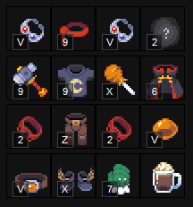

| Slot | Gear |
| --- | --- |
| **Weapons** | +9 Hazardous Vhammer x2. +X orange/green lollipop, +9/+X bat axe. |
| **Headgear** | +7 Band of Fury and beyond. |
| **Chest** | +8 manasteal tshirt, +8 vattire and beyond. |
| **Gloves** | +7 supermittens and beyond. |
| **Pants** | +13 vendor pants. |
| **Shoes** | +X winged boots. |
| **Earrings** | +4/+V crypt earrings. |
| **Amulet** | +2 bfang amulet, +1 mystery amulet. |
| **Belt** | +V basic STR belt. |
| **Rings** | +2 suckerpunch. |
| **Cape** | +8/+9 well crafted cape, vcape. |
| **Orb** | +V STR orb. Jacko for scare skill to disengage if needed. |
| **Elixir** | pumpkin spice. |

#### Mage

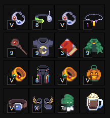

| Slot | Gear |
| --- | --- |
| **Weapon** | +X firestaff, +8 blaster and above, +7 wblade and above. |
| **Offhand** | +5 wbook0, +3 book of secrets. If using a blaster, no offhand can be equipped as it's a two handed weapon. |
| **Headgear** | +9 Hat of the hunter mage, +7 cybernetic implant and above, +13 vendor helmet. |
| **Chest** | +8 manasteal, +8 vattire and above. |
| **Gloves** | +7 super mittens and beyond. |
| **Pants** | +7 starkillers and beyond. |
| **Shoes** | +X winged boots. |
| **Earrings** | +V crypt earrings. |
| **Amulet** | mystery amulet, mpx amulet. |
| **Belt** | +V basic INT belt. |
| **Rings** | +4/+V crypt rings, suckerpunch, zappers. |
| **Cape** | +8/+9 gcape, vcape. |
| **Orb** | INT orb, +V jacko. |
| **Elixir** | pumpkin spice. |

#### Priest

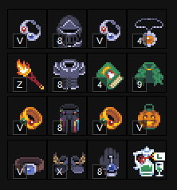

| Slot | Gear |
| --- | --- |
| **Weapon** | +X/+13 firestaff, +9 lunar mace. |
| **Offhand** | +5 wbook0, +3 book of secrets and above, +4 book of cheer. |
| **Headgear** | cybernetic implant, +8 Darkforge and above. |
| **Chest** | +8 Darkforge and above. |
| **Gloves** | +7 mpx gloves and above, supermittens as high as you can. |
| **Pants** | +7 starkillers and above. |
| **Shoes** | +X winged boots. |
| **Earrings** | +4/+V crypt earrings. |
| **Amulet** | +V basic INT amulet, +4 tier2 STR amulet (offers resistance), mpx amulet. |
| **Belt** | +V basic INT belt, well crafted belt, belt of hallowed trials. |
| **Rings** | +V crypt rings, zappers. |
| **Cape** | +9 gcape. |
| **Orb** | INT orb, +V jacko. |
| **Elixir** | elixirluck. |

#### Ranger

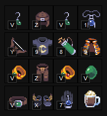

| Slot | Gear |
| --- | --- |
| **Weapon** | +X firebow, +X/+Y bow of the dead, +X/+Y poucher, +9 Crossbow (slower aspeed, higher damage). |
| **Offhand** | +7 agile quiver and above. |
| **Headgear** | +13 vendor helmet, cybernetic implant. |
| **Chest** | +8 manasteal tshirt, +13 vendor coat. |
| **Gloves** | +7 mpx glove and above, supermittens as high as you can get. |
| **Pants** | +13 vendor pants. |
| **Shoes** | +X winged boots. |
| **Earrings** | +V basic DEX earrings, +3/+4 mole teeth. |
| **Amulet** | +V basic DEX amulet, mpx amulet, mystery amulet. |
| **Belt** | +V basic DEX belt. |
| **Rings** | suckerpunch, +5 crypt rings. |
| **Cape** | +9 gcape, vcape, tiger cape. |
| **Orb** | +V DEX orb, jacko for disengage, +2 vtooth to negate fear entirely. |
| **Elixir** | pumpkin spice. |

#### Rogue

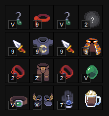

| Slot | Gear |
| --- | --- |
| **Weapons** | +9 dagger of the dead, +8/+9 vdagger, +9/+X firestars. |
| **Headgear** | +7 band of fury and above. |
| **Chest** | +8 manasteal, +8 vattire and above. |
| **Gloves** | +7 mpx gloves and above, supermittens as high as you can. |
| **Pants** | +13 vendor pants. |
| **Shoes** | winged boots +X. |
| **Earrings** | +V basic DEX earrings, +3/+4 mole teeth. |
| **Amulet** | +V basic DEX amulet, mystery amulet, bfang amulet, mpx amulet. |
| **Belt** | +V basic DEX belt. |
| **Rings** | suckerpunch, +4/+V crypt rings. |
| **Cape** | gcape, vcape. |
| **Orb** | +V DEX orb, jacko for disengage. |
| **Elixir** | pumpkin spice. |

#### Paladin

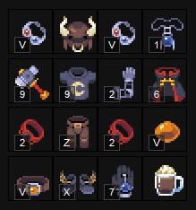

| Slot | Gear |
| --- | --- |
| **Weapon** | +9 vhammer. |
| **Offhand** | +1 exo arm and above, +9 spiked shield and above, +V wbook0 or +3 book of secrets and above. |
| **Headgear** | +13 vendor helmet, OX helmet, Cybernetic Implant. |
| **Chest** | +8 manasteal, +8 vattire and above. |
| **Pants** | +13 vendor pants. |
| **Shoes** | +X winged boots. |
| **Earrings** | +V crypt earrings. |
| **Amulet** | +V basic INT or STR amulet, mystery amulet, stompy's nose ring, mpx amulet. |
| **Belt** | +V basic INT or STR belt. |
| **Rings** | suckerpunch, crypt rings, zappers. |
| **Cape** | +9 gcape, vcape. |
| **Orb** | +V STR orb, INT orb, jacko for disengage. |
| **Elixir** | pumpkin spice. |

